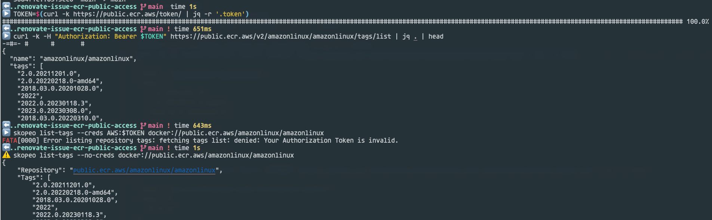
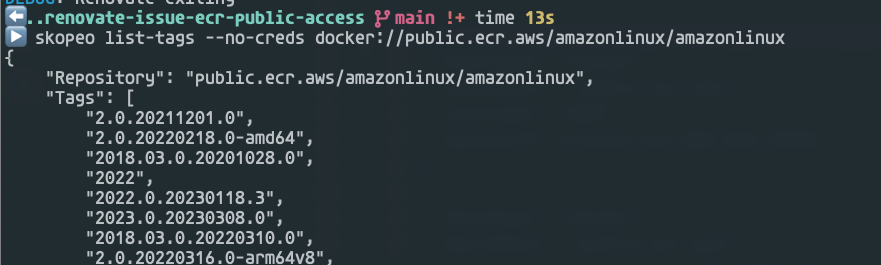
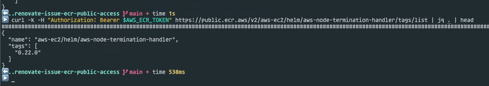
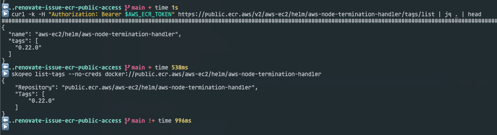

# Renovate Issue ECR public access

- [Question]()

The main issue is, that AWS ECR public registries not supported in full. Renovate seems to have issues accessing ECR repository without any explicit password or access keys.






---


[](https://github.com/ivankatliarchuk/.github/LICENCE)
[](https://github.com/ik-workshop/renovate-issue-ecr-public-access)
[](https://github.com/ik-workshop/renovate-issue-ecr-public-access)


---

## Issue

### Current result

[logs](./output.log)

```json
DEBUG: getManifestResponse(https://public.ecr.aws, eks-distro/kubernetes-csi/livenessprobe, sha256:2de3b646423c2fdf4791cf93c68d77a52608aee791ec678190c091b8c7de65b4, get) (repository=ik-workshop/renovate-issue-ecr-public-access, baseBranch=main)
DEBUG: manifest blob response body missing the "config" property (repository=ik-workshop/renovate-issue-ecr-public-access, baseBranch=main)
       "headers": {
         "content-type": "application/octet-stream",
         "content-length": "712",
         "connection": "close",
         "date": "Fri, 11 Aug 2023 17:59:23 GMT",
         "last-modified": "Wed, 21 Jun 2023 22:51:24 GMT",
         "etag": "\"b788aaf9871cbdfd48381599c2b171b0-1\"",
         "x-amz-server-side-encryption": "AES256",
         "x-amz-version-id": "PG1mTfHM_6OeOuIet0SqDYkNPLXy5xdr",
         "accept-ranges": "bytes",
         "server": "AmazonS3",
         "x-cache": "Hit from cloudfront",
         "via": "1.1 c6c27fb3a8bc413f99e81981948a67c6.cloudfront.net (CloudFront)",
         "x-amz-cf-pop": "MAN50-C1",
         "x-amz-cf-id": "xGT_BTK_ChlaNyq1_XDj2iTcF_XYnWQrjZntMnBRLhaCLPSFnEdSjQ==",
         "age": "57230"
       },
       "body": {
         "name": "aws-node-termination-handler",
         "home": "https://github.com/aws/aws-node-termination-handler/",
         "sources": ["https://github.com/aws/aws-node-termination-handler/"],
         "version": "0.22.0",
         "description": "A Helm chart for the AWS Node Termination Handler.",
         "keywords": ["aws", "eks", "ec2", "node-termination", "spot"],
         "maintainers": [
           {
             "name": "Brandon Wagner",
             "email": "bwagner5@users.noreply.github.com",
             "url": "https://github.com/bwagner5"
           },
           {
             "name": "Jillian Kuentz",
             "email": "jillmon@users.noreply.github.com",
             "url": "https://github.com/jillmon"
           }
         ],
         "icon": "https://raw.githubusercontent.com/aws/eks-charts/master/docs/logo/aws.png",
         "apiVersion": "v2",
         "appVersion": "1.20.0",
         "kubeVersion": ">= 1.16-0",
         "type": "application"
       }
...
...
DEBUG: packageFiles with updates (repository=ik-workshop/renovate-issue-ecr-public-access, baseBranch=main)
       "config": {
         "helm-values": [
           {
             "deps": [
               {
                 "depName": "public.ecr.aws/eks-distro/kubernetes-csi/livenessprobe",
                 "currentValue": "v2.7.0-eks-1-21-16",
                 "datasource": "docker",
                 "replaceString": "v2.7.0-eks-1-21-16",
                 "versioning": "docker",
                 "autoReplaceStringTemplate": "{{newValue}}{{#if newDigest}}@{{newDigest}}{{/if}}",
                 "updates": [],
                 "packageName": "public.ecr.aws/eks-distro/kubernetes-csi/livenessprobe",
                 "warnings": [],
                 "registryUrl": "https://public.ecr.aws",
                 "currentVersion": "v2.7.0",
                 "fixedVersion": "v2.7.0-eks-1-21-16"
               }
             ],
             "packageFile": "examples/values.yaml"
           }
         ],
         "helmv3": [
           {
             "deps": [
               {
                 "depName": "aws-node-termination-handler",
                 "currentValue": "11.14.4",
                 "datasource": "docker",
                 "packageName": "public.ecr.aws/aws-ec2/helm/aws-node-termination-handler",
                 "updates": [],
                 "versioning": "docker",
                 "warnings": [],
                 "registryUrl": "https://public.ecr.aws",
                 "currentVersion": "11.14.4",
                 "fixedVersion": "11.14.4"
               }
             ],
             "datasource": "helm",
             "packageFileVersion": "1.0.0",
             "packageFile": "examples/oci-ecr/Chart.yml"
           }
         ]
       }

```

### Expected result

`updates` section is not empty

For `aws-node-termination-handler` latest version is 0.22.0.

And for `public.ecr.aws/eks-distro/kubernetes-csi/livenessprobe` lates version is `public.ecr.aws/amazonlinux/amazonlinux:2.0.20230727.0-arm64v8`

## Resources

### Commands

```sh
$ helm search repo oci://public.ecr.aws/aws-ec2/helm/aws-node-termination-handler --versions
> not found
$ aws ecr-public get-login-password \
     --region us-east-1 | helm registry login \
     --username AWS \
     --password-stdin public.ecr.aws
$ curl -k https://public.ecr.aws/token/ | jq -r '.token'
> AWS ECR public token
$ TOKEN=$(curl -k https://public.ecr.aws/token/ | jq -r '.token')
$ curl -k -H "Authorization: Bearer $TOKEN" https://public.ecr.aws/v2/amazonlinux/amazonlinux/tags/list | jq . | head
> {
  "name": "amazonlinux/amazonlinux",
  "tags": [
    "2.0.20211201.0",
    "2.0.20220218.0-amd64",
    "2018.03.0.20201028.0",
    "2022",
    "2022.0.20230118.3",
    "2023.0.20230308.0",
    "2018.03.0.20220310.0",
}
$ curl -k -H "Authorization: Bearer $AWS_ECR_TOKEN" https://public.ecr.aws/v2/aws-ec2/helm/aws-node-termination-handler/tags/list | jq . | head
> {
  "name": "aws-ec2/helm/aws-node-termination-handler",
  "tags": [
    "0.22.0"
  ]
}
$ skopeo list-tags --no-creds docker://public.ecr.aws/amazonlinux/amazonlinux
> {
    "Repository": "public.ecr.aws/amazonlinux/amazonlinux",
    "Tags": [
        "2.0.20211201.0",
        "2.0.20220218.0-amd64",
        "2018.03.0.20201028.0",
        "2022",
        "2022.0.20230118.3",
        "2023.0.20230308.0",
        "2018.03.0.20220310.0",
        "2.0.20220316.0-arm64v8",
        "2.0.20220406.1",
        "2.0.20220606.1"
}
$ skopeo list-tags --no-creds docker://public.ecr.aws/aws-ec2/helm/aws-node-termination-handler
> {
    "Repository": "public.ecr.aws/aws-ec2/helm/aws-node-termination-handler",
    "Tags": [
        "0.22.0"
    ]
}
```

### Renovate Docs

- [Example Exercises](./examples)
- [Useful info](./docs/Notes.md)
- [Configuration Options](https://docs.renovatebot.com/configuration-options/)

### Renovate supporting Issues

- [Issue-9268 support public galery](https://github.com/renovatebot/renovate/issues/9268)
- [Issue-19241](https://github.com/renovatebot/renovate/issues/19241)
- [Issue-16912](https://github.com/renovatebot/renovate/issues/16912)
- [Issue-11000](https://github.com/helm/helm/issues/11000)
- [Issue-11322 use instance profile](https://github.com/renovatebot/renovate/issues/11322)
- [issue-3800 Renovate fails to get Docker tags from AWS ECR](https://github.com/renovatebot/renovate/issues/3800)
- [issue-6885 ECR repository behind friendly URL throws errors](https://github.com/renovatebot/renovate/issues/6885)

### Supporting Docs

- [Renovate manager](https://docs.renovatebot.com/modules/manager/)
- [Renovate home sources](https://github.com/renovatebot/renovate/blob/main/lib/modules/manager/helmv3/artifacts.ts#L36)
- [ECR content discovery](https://github.com/opencontainers/distribution-spec/blob/main/spec.md#content-discovery)
- [Public ECR gallery](https://gallery.ecr.aws/)
- [Renovate connect to AWS ECR registry](https://docs.renovatebot.com/docker/#aws-ecr-amazon-web-services-elastic-container-registry)
- [Authenticate to AWS REgistry](https://docs.aws.amazon.com/eks/latest/userguide/copy-image-to-repository.html)
- [Amazon Container Image Registries](https://docs.aws.amazon.com/eks/latest/userguide/add-ons-images.html)
- [AWS CLI public registries](https://docs.aws.amazon.com/cli/latest/reference/ecr-public/index.html)

---

<!-- resources -->
[template.generate]: https://github.com/ik-workshop/renovate-issue-ecr-public-access/generate
[code-style.badge]: https://img.shields.io/badge/code_style-prettier-ff69b4.svg?style=flat-square
